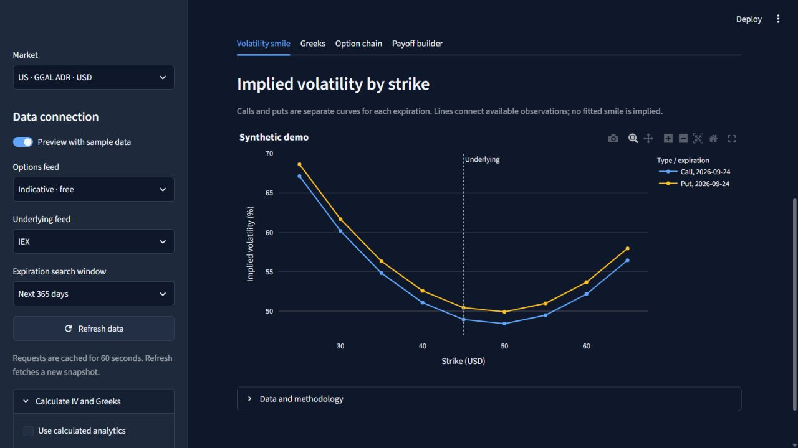
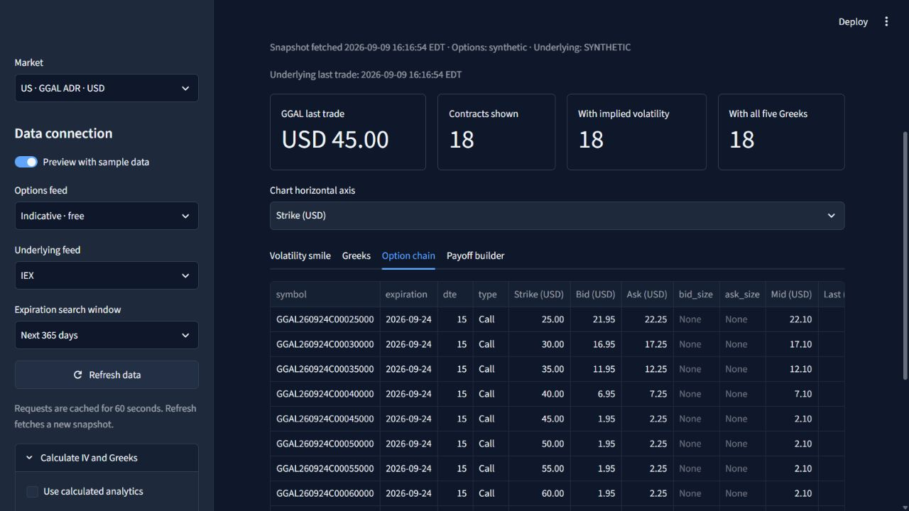
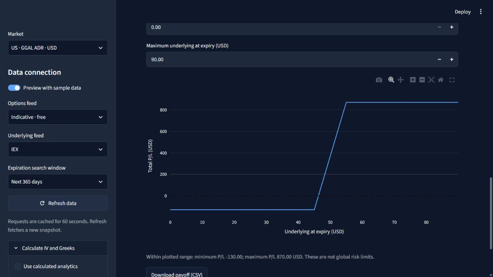

<strong>BYMA · GGAL ADR · OPTIONS RESEARCH</strong>

# Galicia Options

### A closer look at volatility, risk and the shape of an options strategy.

Explore Grupo Financiero Galicia across Argentina’s local market and its US-listed ADR. 
One workspace for option chains, volatility smiles, sensitivities and expiration payoffs.

**[Explore the dashboard](#inside-the-dashboard)** &nbsp; · &nbsp; **[Setup & usage](GUIDE.md)** &nbsp; · &nbsp; **[Research notes](#the-research-behind-the-screen)**

 

<em>The dashboard’s sample preview: call and put volatility across strikes, with the underlying price as a reference.</em>

## One company. Two markets. Different perspectives.

Galicia’s local shares and US-listed ADR each have their own option chains, currencies and data conventions. This project brings both into a focused research interface, with room to move from a single contract to the wider shape of the market.

| 🇦🇷 Local shares | 🇺🇸 US-listed ADR |
| :--- | :--- |
| **BYMA · ARS** | **GGAL ADR · USD** |
| Public BYMADATA Open connection, with no API key required. | Alpaca market data, with access determined by feed entitlements. |
| Option-chain exploration and caución-based funding research. | Volatility smiles, option sensitivities and saved snapshot replay. |

## Inside the dashboard

**Read the shape of volatility.** Compare calls and puts across strikes and expirations, switch between strike and moneyness, and explore Delta, Gamma, Theta, Vega and Rho. Optional calculated analytics make the model assumptions explicit.

**Look beneath the curve.** Inspect individual contracts, bid–ask spreads and quote-quality labels. Filter the chain and export the observations behind the charts.

**Give a strategy a shape.** Combine long or short calls, puts and shares, set entry premiums and contract sizes, and see how the combined payoff changes with the underlying price at expiration.

<em>Actual application screenshots, captured in sample mode. Prices and analytics are synthetic; the payoff example uses hypothetical entry premiums.</em>

## The research behind the screen

The project also explores VIX-style volatility calculations for Galicia, with saved observations, constituent-level audits and explicit funding assumptions. The aim is to make each result traceable to its inputs—and to show where the available data cannot support a result.

Current volatility-index outputs are **research diagnostics**. A validated Galicia 30-day index is not published. Feed limitations, missing quotes and American-option exercise features matter when interpreting the results.

| Read more | What’s inside |
| :--- | :--- |
| [Setup & usage guide](GUIDE.md) | Installation, connections, controls, analytics conventions and validation commands. |
| [Local-market volatility research](GALICIA_VOLATILITY_RESEARCH.md) | BYMA methodology, recorded evidence and feasibility. |
| [ADR volatility research](GALICIA_ADR_VOLATILITY_RESEARCH.md) | Saved Alpaca observations, replay and quote-quality findings. |
| [ARS funding methodology](ARS_FUNDING_METHODOLOGY.md) | Caución curves, expiry matching and funding assumptions. |
| [Data sources](DATA_SOURCES.md) | Coverage, limitations and alternative providers. |

---

**Built with Python · Streamlit · Plotly · pandas**

A research workspace for exploring options. Market-data access only; no order execution.

[Open the setup & usage guide →](GUIDE.md)

